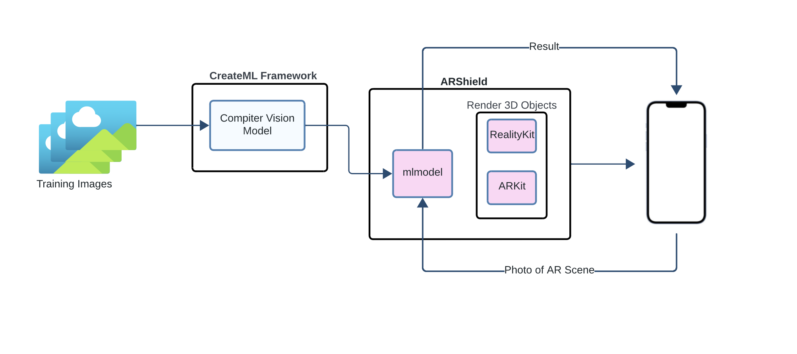

# ARShield

This application uses computer vision techniques to detect clickjacking attacks within Apple's ARKit/RealityKit

Please see GitHub Repo Here: https://github.com/aniavetian/ARShield

## What Is In this Repo?

1. `ARShield`
   - Contains the project to detect clickjacking attacks in ARKit/RealityKit
   - This is the project that has directions to run in the "Running the App" section.
2. `ARShieldObject`
   - Contains code used to make test cases to train the ML models
3. ClickjackingTesting + ClickjackingTraining Folders
   - Photos and annotations used to train the clickjacking object detection model
4. ImageDetection + ImageDetectionTraining Folders
   - Photos and annotations used to train the clickjacking image detection model
5. `ClickjackingDetection.mlproj` (Object Detection) + `ClickjackingImageClassifier.mlproj` (Image Detection)
   - CreateML models that were used in the training of their the object detection model and the image detection model
5. Research Paper
   - Contains the Latex files for the final research paper. Also contains the paper in PDF format.

## Architecture

Training photos of clickjacking attacks vs non-clickjacking attacks were collected. These images were annotated properly and classified for the machine learning model to read. Using the CreateML framework, Apple's framework to train ML models, the training photos along with testing photos were loaded in. Once a fully trained and tested model was ready, it was loaded into the ARShield application as a .mlmodel file. The code in ARShield could now be configured to use the ML model to make predictions. ARShield generates 3D objects using ARKit and RealityKit that can be moved around but initially spawn on top of each other. A photo of the AR scene can be fed into the ML model to do predictions of whether there is a clickjacking attack or not. The result is displayed to the user.

## How To Use

When the application launches, two cubes will spawn on top of each other. These cubes can be moved around to resemble a clickjacking attack vs no attack. Once you are satisfied with the cubes position you can click "Take Photo" to feed the 3D objects into the ML Model. The result of whether clickjacking was detected will be shown to the user.

To see a demo click [here!](https://drive.google.com/file/d/1eJTEqjk00r1rjFFFAXIO7ilAIvJjso_m/view?resourcekey)

## Technologies Used

1. CreateML - Version 5.0
2. Xcode - Version 15.0
   - ARKit - Version 6
   - RealityKit - Version 2
3. iOS Capable Device (iPhone) - iPhone 13 Max Pro
4. iOS Verion 17.3.1

## Pre-Requisites to Running App Locally

1. You will need a computer running MacOS as any of the technologies used can only be opened on MacOS computers.
2. You will only be able to run this application on an iOS device. It cannot be run on the Xcode simulator as it contains augmented reality.
3. You will need an iOS device with iOS 11 or later to run ARKit and your iOS device must have a A9 or later processor.
4. You will need an Apple developer account to run the application on your iOS device. This is seperate from an iCloud account.

## Running the App

1. Download the project and open on Xcode.
2. Follow [this guide](https://developer.apple.com/documentation/xcode/running-your-app-in-simulator-or-on-a-device) to set up development on your iOS device as you cannot run this app on the Xcode simulator.
3. Follow [this guide](https://developer.apple.com/documentation/arkit/verifying_device_support_and_user_permission#) to allow camera access for ARKit app to run.
4. On Xcode select your device to run the project on (Make sure your device is connected via a wire to your computer).
5. Click the "Run" button or do `CMD + R`.
6. Open the app on your iOS device and detect clickjacking.
